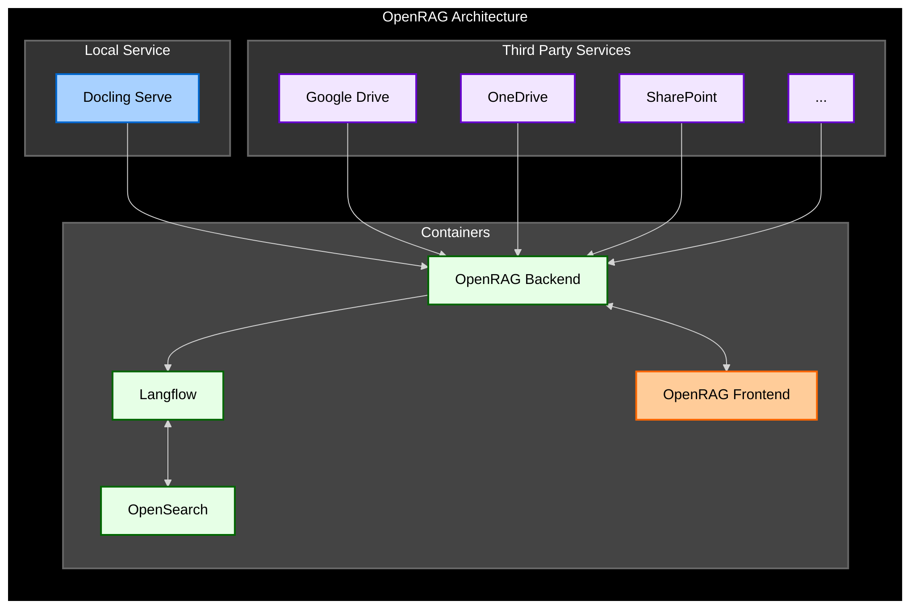

OpenRAG is an open-source package for building agentic RAG systems that integrates with a wide range of orchestration tools, vector databases, and LLM providers.

OpenRAG connects and amplifies three popular, proven open-source projects into one powerful platform:

* [Langflow](https://docs.langflow.org): Langflow is a versatile tool for building and deploying AI agents and MCP servers. It supports all major LLMs, vector databases, and a growing library of AI tools.

* [OpenSearch](https://docs.opensearch.org/latest/): OpenSearch is a community-driven, Apache 2.0-licensed open source search and analytics suite that makes it easy to ingest, search, visualize, and analyze data.

* [Docling](https://docling-project.github.io/docling/): Docling simplifies document processing, parsing diverse formats — including advanced PDF understanding — and providing seamless integrations with the gen AI ecosystem.

OpenRAG builds on Langflow's familiar interface while adding OpenSearch for vector storage and Docling for simplified document parsing. It uses opinionated flows that serve as ready-to-use recipes for ingestion, retrieval, and generation from familiar sources like Google Drive, OneDrive, and SharePoint.

What's more, every part of the stack is interchangeable: You can write your own custom components in Python, try different language models, and customize your flows to build a personalized agentic RAG system.

:::tip
Ready to get started? Try the [quickstart](/quickstart) to install OpenRAG and start exploring in minutes.
:::

## OpenRAG architecture

OpenRAG deploys and orchestrates a lightweight, container-based architecture that combines **Langflow**, **OpenSearch**, and **Docling** into a cohesive RAG platform.

* The **OpenRAG Backend** is the central orchestration service that coordinates all other components.

* **Langflow** provides a visual workflow engine for building AI agents, and connects to **OpenSearch** for vector storage and retrieval.

* **Docling Serve** is a local document processing service managed by the **OpenRAG Backend**.

* **External connectors** integrate third-party cloud storage services through OAuth authenticated connections to the **OpenRAG Backend**, allowing synchronization of external storage with your OpenSearch knowledge base.

* The **OpenRAG Frontend** provides the user interface for interacting with the platform.